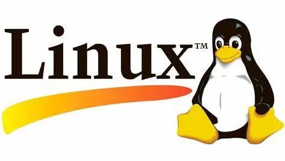

# 这里是课程指引

### 授课时间与内容

* 第一讲

    * 时间：2023 秋季学期第五周周日 15:00-16:30
    * 讲师：教研院 刘润达 & 计 03 安一帆
    * 内容：认识计算机——从前端到底层，ChatGPT 是如何运转起来的？
    * 简介：2022-2023 年，对话助手 ChatGPT、作画模型 Stable Diffusion 等 “生成式人工智能技术”（AIGC）让人们心潮澎湃。回想起来，每一年都有令人兴奋的产品或概念，闯入我们的视线：2022 年的 AIGC、2021 年的元宇宙、2020 年的《原神》……但它们都不是凭空诞生，而是在一套逐级抽象、不断演进的计算机技术体系之上，生长、搭建出来。本次培训将围绕“ChatGPT 究竟用到了多少项计算机技术”，尝试为大家展示计算机技术体系的浮光掠影，从而帮助大家更直观地认识计算机系本科课程体系，初步了解“这每门课都有什么用处”。
    * 讲义：[第一节课讲义](https://kdocs.cn/l/caKESY15Yqyo)
    * 课程回放：[第一节课回放](https://cloud.tsinghua.edu.cn/f/d0201dc8b6b2452ba3a7/)

* 第二讲

    * 时间：2023 秋季学期第七周周日 15:30-17:00
    * 讲师：计 16 李骋昊
    * 内容：编辑器与标记语言——VSCode 与 markdown
    * 简介：本节课程是科普性质，将介绍一些常见工具和作为 cs 学生的常识。你是否想了解——环境变量，编译器，链接器，IDE，编辑器，调试器分别是什么？当你在 VSCode 中点击按钮然后运行代码时，发生了什么？README.md 究竟是个什么格式？“烫烫烫”“锟斤拷”是什么梗？在这节课上，都可以找到答案。
    * 讲义：[第二节课讲义](https://cloud.tsinghua.edu.cn/d/cce7da2c3c4a48f89e45/)
    * 课程回放：[第二节课回放](https://cloud.tsinghua.edu.cn/f/2ea9063bf5f84970a8dc/)

* 第三讲

    * 时间：2023 秋季学期第十周周日 15:00-16:30
    * 讲师：计 13 花佳诚
    * 内容：Linux 入门——认识 shell 语言
    * 简介：本节课将会介绍 Linux 系统的基本概念和工具使用。你将会学习到如何使用 Linux 的 shell，这是一个强大的命令行界面，可以让你在操作系统中执行各种任务。此外，对于命令行中的一些常用命令和工具也会有所具体介绍。本课程结束后，你将会掌握一些基本的 Linux 技能和知识，这将会为你未来的学习和职业发展提供一个坚实的基础。
    * 链接：Coming soon...

* 第四讲

    * 时间：2023 春季学期第五周周末
    * 讲师：计 17 魏辰轩
    * 内容：Git 入门——学会协作开发
    * 简介：TODO
    * 链接：Coming soon...

* 第五讲

    * 时间：2023 春季学期第七周周末
    * 讲师：
    * 内容：C++ 编译链——编译、链接、CMake
    * 简介：TODO
    * 链接：Coming soon...

* 第六讲

    * 时间：2023 春季学期第十周周末
    * 讲师：
    * 内容：Web 基础——Web 前端与 HTTP 协议
    * 简介：TODO
    * 链接：Coming soon...

### 培养方案课程对应
- 第一讲的内容是偏科普性质的介绍，让我们跳出固有印象，从更深入的角度了解计算机的结构组成。
- 第二讲、第三讲的内容与 **程序设计基础** 课程紧密相关，帮助同学们初步成为合格的开发者。
- 第四讲的内容是程序员们协作开发较大项目的必修课，与后续的 **软件工程** 等课程息息相关，也是养成良好合作习惯的基础。
- 第五讲的内容与 **面向对象的程序设计基础** 相关，承接课堂知识，进一步介绍多文件编译链接相关内容。
- 第六讲的内容属于拓展内容，帮助同学们初步了解网页应用中涉及的主要技术，入门初步的前后端开发（也与 **软件工程** 课程有关）。